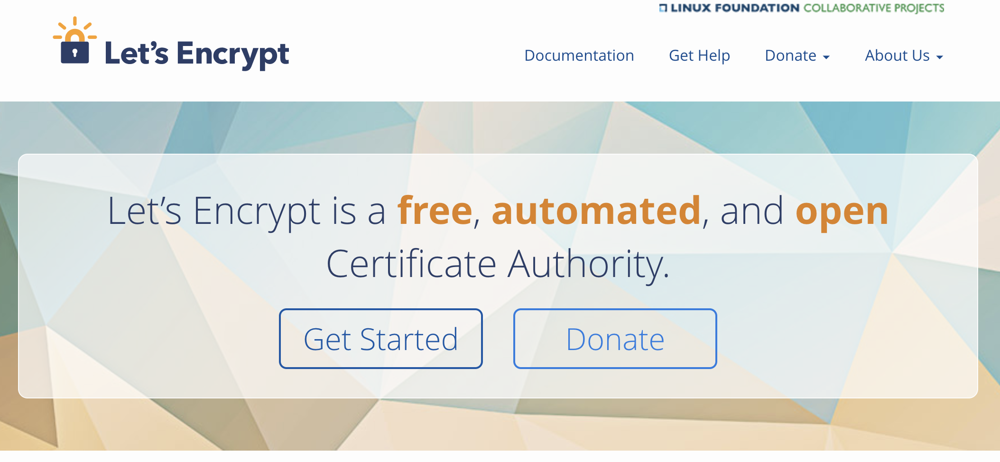
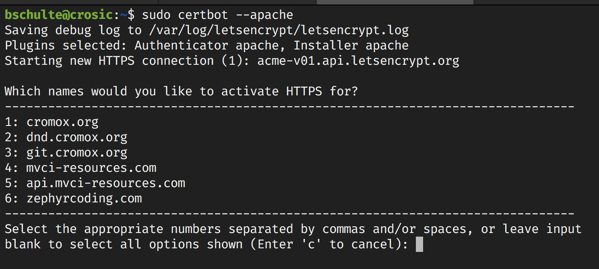

Website encryption is a vital part of ensuring your user's safety when they visit your sites. Without it, anyone on the same network can intercept and read/modify all traffic between your users and sites. Thankfully, with [Let's Encrypt](https://letsencrypt.org/) there's basically no reason to not protect your websites' traffic through SSL.

Many hosting providers have integration for Let's Encrypt which let's you simply upload a generated certificate and apply it to your site. What's this certificate you ask? Certificates are digital signatures that are used for the mathematical operations of encrypting your sites data and also allows users to verify your site is who you claim it to be. In this post, we'll be going over how to use Let's Encrypt with your self hosted sites through something like a VPS.

Certbot is a wonderful tool provided by the fine folks over at the [Electronic Frontier Foundation](https://www.eff.org). Certbot is a client designed to integrate with Let's Encrypt that will help you with setting up your sites with SSL. You can simply select the type of web server you're using along with the host OS and you'll be provided with instructions on how to get started.

Once you complete the install instructions, you can issue the startup command provided by the Certbot documentation:

If you've got your sites already setup and configured on the server, Certbot will automatically detect them and ask if you want to generate certificates for. You'll follow a couple more steps including setting up rules for redirecting HTTP traffic to HTTPS to ensure your users' connections are always encrypted.

And that's it! It's that simple to setup SSL for all your websites for free and all in less than 10 minutes.
