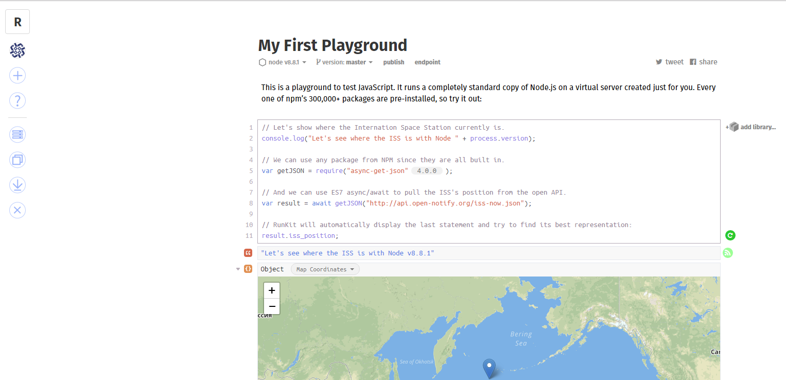

This series of tutorials is aimed at teaching the process of programming in Javascript, starting from the basics. Prior programming experience is not needed to follow along in the tutorials, which start at the very beginning. It helps to have some prior programming experience, but you should be able to follow these tutorials if they're your first foray into the field of computer programming. All of the tutorials included here will be based on the user executing all programming on Windows. There may be some differences noted throughout if you are a user of another platform, but should not make any extreme differences in the user learning the skills.

In this first tutorial, you will learn how to set up your computer environment for a successful beginning to your programming journey.

## The Editor

In order to write code we have to have something to write that code in! Technically speaking, you can write code in anything that lets you type text into a file and save it. However, there are a myriad of programs available that provide all types of benefits to help you write code. My favorite editor, and the one we'll be using in this tutorial is [Visual Studio Code](https://code.visualstudio.com/) (VS Code). This editor is an open source project developed by Microsoft that runs on Windows, Mac, and Linux. As of the writing of the article, it can be argued that VS Code is the up and coming hot-shot in the realm of Javascript editors, so you can rest assured that it will have any features you need for development and more. In a separate article I'll go over VS code in detail, but for the main tutorial series I'll only introduce whatever features we need to use to progress.

For now, [download and install VS Code](https://code.visualstudio.com/download) onto your system and we can proceed.

The main view in VS Code will be where you can write all of your code that we'll be learning. The interface is fairly basic, with your current workspace open on the left (don't worry that your screen doesn't look quite like mine, I'll cover that in the VS Code tutorial). You can create a new file with:

`File -> New File`

Ctrl+S will save the file and you can name it "javascriptBasics.js".

## Node JS

The main use for Javascript that most people think of is in the browser where Javascript helps with performing tasks on a website. Node JS is a program that allows Javascript files to be run directly from the command line of a computer. This allows us test out the Javascript files that we write directly on our computer. Let's get your environment setup to run Javascript files from the command line:

1.  Download and install [Node JS](https://nodejs.org/en/)
2.  Close and re-open VS Code. This is so that the built in command line that VS code has can recognize that Node has been installed
3.  Open VS Code's integrated command line (or terminal) with `` ctrl+` ``
4.  Type in `node` to test and see if Node has been installed properly. You should see a '>' character that you can type next to. This is Node's interactive environment that we can cover in another lesson. For now, as long as it comes up we know that things are working.
5.  Hit `ctrl+d` to exit out of Node
6.  When you opened the integrated terminal of VS Code you should be in the same directory that you created and saved your new _.js_ file. If not, you can use the `cd` command to move to the directory you saved your new file in.
7.  Write `console.log('Hello World!')` into your .js file.
8.  From VS Code's command line enter the command: `node javascriptBasics.js` and hit enter (where _javascriptBasics.js_ is the name of your _.js_ file)
9.  You should see 'Hello World!' written to the console.

Congratulations! You just ran your first Javascript program. The result of everything you just did should look something like:

## Alternatives to the Editor

I prefer the flexibility of working with things directly in an editor on my computer, but there is an easy alternative to setting all of this up. There are a few websites out there that let you write JS code and run it directly in your browser. These environments also provide you with the entire Node ecosystem so you can include any third party Node JS library out there to test out (we'll go over these in a future less on). Let's take a look at a few of the sites available at the time of writing this article:

### Runkit.com

Runkit.com is a website that creates a virtual server for you to test out Node JS code. It also lets you actually download your code if you'd like to as well. One thing that Runkit does which seems to be unique is it will interpret the outputted data and attempt to present it in a way that makes the most sense. In the screenshot, you can see it displaying a set of coordinates on an actual Google Map.

### KataCoda.com

KataCoda is nice since it provides an actual terminal for you to test out command line commands along with your coding. The terminal is a Bash terminal, which is one of the standard types of terminals that Linux uses so it might be different from your local terminal. It still is a nice addition that can give you so more experience and exposure to a new technology.

## Node JS vs JS

At this point, you might be wondering if there's any difference between what we've been calling "Node JS" and just "Javascript. The short answer is that there really is no difference. JS is JS, but when we say Node JS that typically refers to Javascript that is interpreted and run by the Node program as opposed to say the browser. Remember, since JS is an **interpreted** language a separate program has to be used in order to actually have the computer run the code. Node is just one of those programs that can **interpret** the JS code for the computer. Node also provides a rich ecosystem of third party modules that can be used for any number of tasks.

---

## Words to Know

### The Command Line

The command line refers to a computer program that lets you type in commands directly to the computer. In Windows, the built in command line can be accessed by hitting the the Windows key (usually between your left 'alt' and 'ctrl' or 'fn' keys), typing in 'cmd' and hitting enter. This will open up the command prompt allowing you to type in commands. To run your code you will have to navigate to the folder where you saved your Javascript file in the previous step. We'll use the command `cd` (change directory) to move between directories. The directory that you're currently in is by default shown to the left of your cursor. You can use the cd command as such: `cd Documents` where "Documents" is the directory to change to. Using `cd ..` moves one directory up in the directory tree. Before you run your Javascript files,you should navigate to the directory where you saved it.
