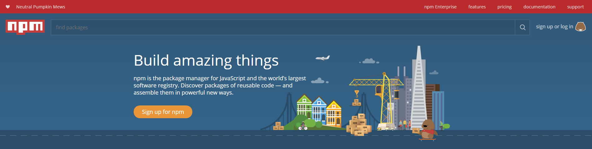
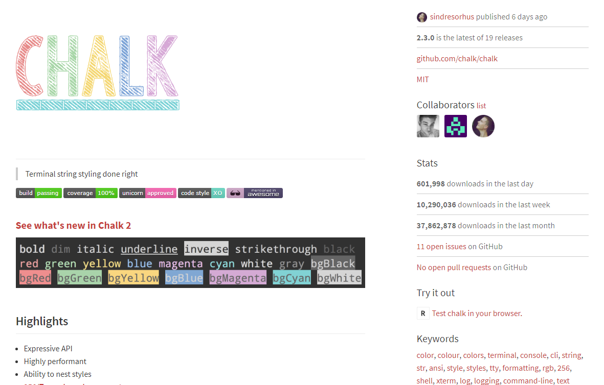

Lucky for us, the population of Javascript developers is a huge one. This leads to an expansive ecosystem of 3rd party modules available to to help in our scripts. Node Package Manager (or npm) is the standard package manager for Javascript modules. It provides a platform for developers to push their own modules to the public for anyone else to use. Packages exist for large percentage of tasks that you might want to accomplish. Learning how to search for modules and use them is a huge part in your development life. Let's get setup to start testing out some Javascript modules (if you're using one of the Node JS development websites you don't have to do any of this):

1.  Open the integrated terminal in VS Code (`` ctrl+` ``)
2.  NPM should have been installed automatically when you installed Node JS. To test this, run: `npm -v` in your terminal. You should see the version number of NPM
3.  Run `npm init -y`. This will initialize a `package.json` file inside of your current directory.
4.  Install a package to test things out, in this case the `chalk` module: `npm install --save chalk`

## package.json

The `package.json` file can be responsible for a large number of things, but it's main purpose is to keep track of the dependencies for your project in order for it to run. The command we ran in step 4 installed the `chalk` module for our project and downloaded that module into a new `node_modules` folder in your directory. This is the standard location that all npm modules are installed to. Since we used `--save` in our command, the entry was also added to our `package.json` file. If we needed to migrate our project to a new place, because `package.json` keeps track of all the modules our program needs, we don't have to copy the whole `node_modules` folder (which can get quite large). We can just copy the `package.json` file and all our own code and then run `npm install`. That command will read the `package.json` file to know which modules the program requires and automatically install them.

## Using your new Node module

We've installed the chalk module, but let's talk a bit more about what it is and how we can use it. Each node module typically has a page with information about the module and how to use it.



This is an example of information from the NPM site for the `chalk` package. Let's break it down a bit and figure out how to use it. The `require` keyword is the way that we load external modules into our programs for us to use. In the above picture, you can see that to use the `chalk` module we should do: `var chalk = require('chalk')`. This loads in the `chalk` module and stores it in the variable named `chalk`. From there, we can use our `chalk` object to call functions that the module provides.

```js
console.log(chalk.green('This will be green text'))
console.log(chalk.blue.bgRed('This will be blue text on a red background'))
```

Chalk is a module to print out colored text to the terminal through `console.log` statements. For every module it'll take some time reading the documentation to understand how to use it. `chalk` is pretty straightforward though as we can see through the code samples above. The way you use it is by calling chalk inside of a console.log statement and call the function on chalk that corresponds to what type of text you want to print.

---

## Words to Know

### Module/Package

Both of these words refer to 3rd party code that is packaged together to be pulled in and used by a project. The file that keeps track of dependencies is called package.json and the directory containing those packages is called node_modules, but they both refer to the same thing.
