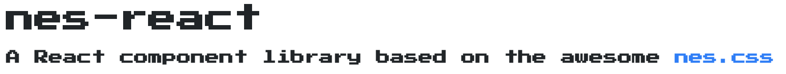
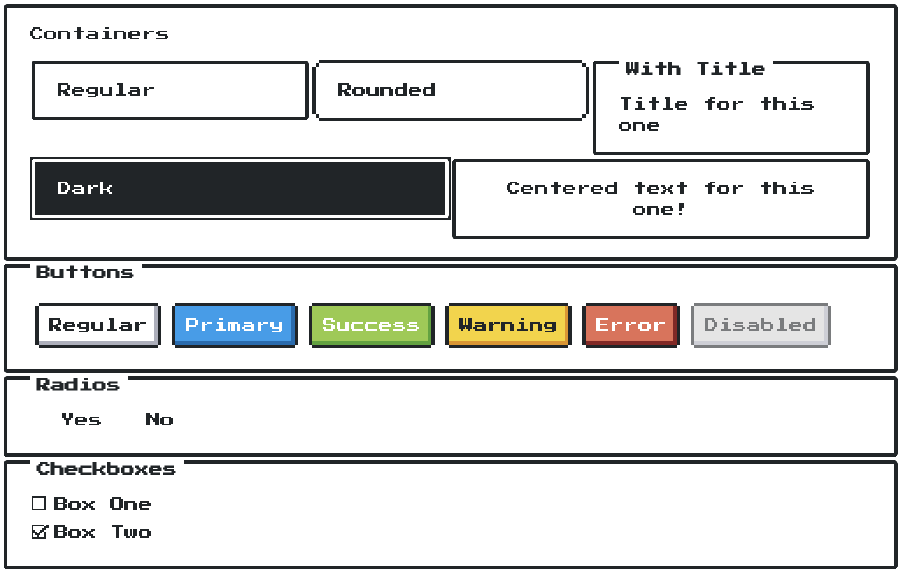
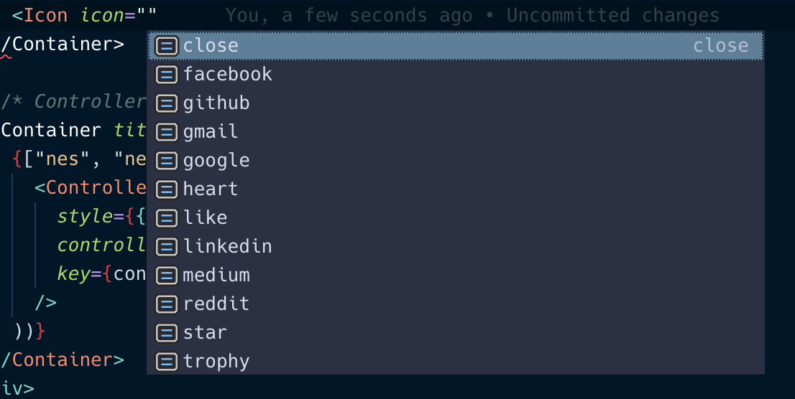

A while ago, I came across an awesome CSS framework inspired by the retro visuals of the NES: [nes.css](https://github.com/nostalgic-css/NES.css). Not sure knowing where I'd use it, I knew that at some point I'd probably like to use it in a React based project. Motivated by that feeling, I started to work on React wrappers for it.

nes.css just released v1 today and one of the contributors opened up an issue on my project letting me know about it so I decided to update my library and add in all the components that I was missing.

After finishing that up, I present [nes-react, a React component library wrapping nes.css](https://github.com/bschulte/nes-react):



To create the library, I used the awesome [create-react-library](https://github.com/transitive-bullshit/create-react-library), a CLI for bootstrapping a React component library. I tried out a couple of options, but this one just worked perfectly out of the box for me. It's setup to easily develop both a demo app using your component library as well as the library itself. Deploying to Github Pages based on your example app is also just an NPM command away.

I ended up using Typescript for the component library to have built in typings generated for better auto-complete while working with it. In practice the main thing that Typescript brought was allowing the declaration of interfaces describing what props will be passed into the components.

Here's an example from the Table component:

```tsx
import * as React from 'react'
import classNames from 'classnames'

interface TableProps {
  bordered: boolean
  centered: boolean
  dark: boolean
  style: any
}

export default class Table extends React.Component<TableProps, any> {
  public render() {
    const { bordered, centered, style, children, dark } = this.props
    return (
      <table
        className={classNames('nes-table', {
          'is-bordered': bordered,
          'is-centered': centered,
          'is-dark': dark
        })}
        style={style}
      >
        {children}
      </table>
    )
  }
}
```

We declare the props that can be passed to the component via an interface and then used as the generic value for the class declaration (check out more about generics [here](https://www.typescriptlang.org/docs/handbook/generics.html)).

This gives nice autocomplete in editors:



---

If you're looking to build something retro or pixel-art related in React, check out [nes-react](https://bschulte.github.io/nes-react/). Hopefully I'll find a project to use this library in soon!
