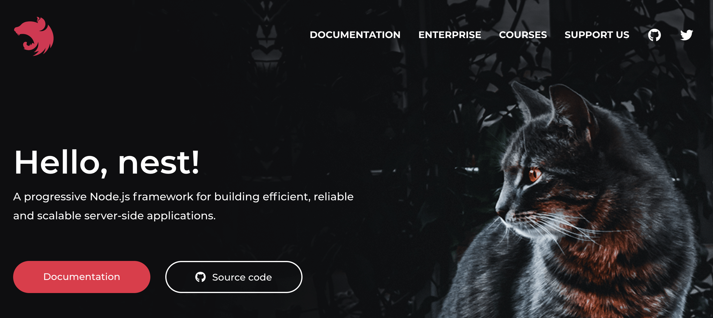

[Boilerplate Repo](https://github.com/bschulte/nestjs-boilerplate)

I've always wanted to write this post since one of my favorite things to do in software development is build customized starter templates for me to jump-start future projects. It's most certainly taken up more time in comparison to developing actual projects than I'd care to admit.

Each of these boilerplates have been a Node-based solution, but I've jumped between different frameworks as well as stitching together amalgamations of my own. I've eventually settled on letting a framework do a lot of the heavy lifting for me - [NestJS](https://nestjs.com).

While Nest does give us a great base and excellent structure to start with, for my boilerplate to be complete (for now) I needed to add a set of modules containing common functionality to really have something I could hit the ground running with on a new project.

I won't detail the actual functionality of the built-in Nest modules that I've chosen to use in the boilerplate, but I'll at least outline the ones I've included.

- [@nestjs/serve-static](https://github.com/nestjs/serve-static)
  - Serves static assets
- [@nestjs/typeorm](https://github.com/nestjs/typeorm)
  - Great Typescript-based MySQL ORM. This could easily be swapped for something like Sequelize or Mongoose. I'm more comfortable with MySQL so that's what I went with.
- [@nestjs/graphql](https://github.com/nestjs/graphql)
  - Awesome library for using GraphQL with Nest. Brings in some great features from one my my favorite libraries that I've worked with: [type-graphql](https://github.com/MichalLytek/type-graphql)

Now we can get into the modules that I've added to the boilerplate that will hold common functionality which I use across many projects.

## App Configuration

This is a pretty simple module that utilizes the [Dotenv](https://github.com/motdotla/dotenv) package. This lets you use a `.env` file in your projects to configure the app based on different environments that it might operate in.

```ts
import * as dotenv from 'dotenv'
import * as fs from 'fs'
import { Injectable } from '@nestjs/common'

@Injectable()
export class DotenvService {
  private readonly envConfig: Record<string, string>

  constructor(filePath: string) {
    this.envConfig = dotenv.parse(fs.readFileSync(filePath))
  }

  public get(key: string): string {
    return this.envConfig[key]
  }
}
```

Other modules can inject this service and utilize its `get` method to retrieve configuration values.

## Authentication

I decided to use a JWT based local authentication system for the boilerplate. I don't find passport particularly useful when I'm only utilizing local login which I often am. The system works through a combination of Nest middleware and guards.

`auth.middleware.ts` operates on every request to every route on the app and looks for a JWT or API key in either the `Authorization` header, query string, or request body. It'll then try to find a user in the database corresponding to the identified credential and attach that user to the request object to be consumed in the other modules. I know some apps just use the user data that may be stored in the JWT, but I prefer the approach to doing a fresh database lookup on each request since this allows any access or configuration changes we've made to the user to take effect without the user having to obtain another JWT.

To actually protect controllers and resolver I utilize Nest guards. A good example to go over is my simple `AuthGuard` which only requires that there be _any_ authenticated user for the request to proceed.

```ts
import { Injectable, CanActivate, ExecutionContext } from '@nestjs/common'
import { RequestWithUser } from 'src/shared/types'
import { GqlExecutionContext } from '@nestjs/graphql'
import { BackendLogger } from 'src/modules/logger/BackendLogger'

@Injectable()
export class AuthGuard implements CanActivate {
  private readonly logger = new BackendLogger(AuthGuard.name)

  public async canActivate(context: ExecutionContext) {
    let request: RequestWithUser = context.switchToHttp().getRequest()

    if (!request) {
      const ctx = GqlExecutionContext.create(context)
      request = ctx.getContext().req
    }

    if (!request.user) {
      this.logger.warn(`No user found for request: ${request.path}`)
    }

    return !!request.user
  }
}
```

The only tricky thing is to understand how we access the request object within the guard. Check out Nest documentation for actually retrieving the context, but the approach differs between REST API calls and GraphQL requests, so we want to handle both in the same guard to be able to use it in both scenarios.

We also need to take a quick peek inside the `app` module to see how the request object is added to the GraphQL context:

```ts
GraphQLModule.forRootAsync({
  useFactory: async (dotenvService: DotenvService) => ({
    debug: dotenvService.get('NODE_ENV') === 'development',
    playground: dotenvService.get('NODE_ENV') === 'development',
    autoSchemaFile: true,
    context: ({ req }) => ({ req })
  }),
  inject: [DotenvService]
})
```

The line of `context: ({ req }) => ({ req })` is the important part here. It will take the Express request object and attach it to the GraphQL context. That way we have access to it in the guard.

## Emailing

Most apps at some point that I've worked with need emailing functionality. I've chosen what I believe is a fairly bare-bones approach that utilizes [nodemailer](https://github.com/nodemailer/nodemailer) to send emails through a standard Gmail account. I've used my own basic approach to templating the emails as well, with a "parent" template enclosing all emails and individual email templates written in code as functions that return a template string.

## User Notifications

In a lot of apps I've built, it's been important to allow for users to receive notifications in their account, so I've included a module for that here. The module consists of two entities: `Notification` and `NotificationStatus`. `Notification` represents the actual notification content such as the title and body, while the `NotificationStatus` entity is created for each user that should see that particular notification. In other words, the relationship between the two is `Notification` _hasMany_ `NotificationStatus`.

## User Management

The modules that contains the most baked in logic are ones related to the user management. Each user has a `UserAccess` and `UserConfig` entity attached to it. `UserAccess` is meant to hold access control flags for the user (such as roles) and `UserConfig` contains configuration and preference values for the user (designed to be controlled by the user themselves).

User groups and sub-groups are setup already and allow users to be admins of their groups. This might not be needed for many apps, but for commercial apps this is more likely to be a requirement. A `GroupUserAccess` entity is also tied to the users which is intended to hold access values that not only a site admin can change, but that user's group admin can change as well.

Routes and logic are present in the boilerplate to handle many typical user actions such as logging in and resetting their password. (User registration isn't baked in right now, but user creation is available via the CLI).

## Miscellaneous Parts/Tips

### Bootstrapping New Modules

One thing that drove me crazy was putting together all the boilerplate code that was required for Nest modules. To combat that, I created a script that will scaffold out a full module for you in one command with a controller, resolver, entity, service, module, and spec (test) file. You can run it with `./scripts/bootstrapModule <name_of_module_in_camel_case>`. For instance: `./scripts/bootstrapModule newTest` will create modules that will have the class name prefix of `NewTest` and file name prefix of `newTest`.

### Testing

I have admittedly no testing in this boilerplate (bad, I know). I do generate spec files when bootstrapping modules and utilize the testing library that Nest provides which is detailed [here](https://docs.nestjs.com/fundamentals/testing).

### Security Note

One thing I know that I do not handle properly is API keys and password reset tokens. These are both sensitive pieces of information and as such should be stored encrypted in the database.

### Deployment

This is still a work in progress piece for me. I've been toying with different ways of deploying/running the app as you can probably tell from the various configuration files and scripts. I'd encourage you to try out different options and just use whatever works best for you. Here's a list of the methods I've tried:

- Deploying the raw TS files and using `ts-node` to run things.
  - This approach seems to usually be the easiest and I don't see any real meaningful downsides to just using `ts-node` over `node`.
- Building the transpiled JS files through `npm run build`
  - This option and the previous are usually pretty comparable for me.
- Running everything in Docker
  - This will definitely be my go-to for deployment if my environment requires anything outside of a basic node install. For instance I've had a project where I called a few Python scripts from my Node app so I managed everything in Docker to avoid having to install Node, Python, and any additional dependencies in each place I wanted to deploy.
- Using [Zeit's pkg](https://github.com/zeit/pkg)
  - This is the newest one I've tried and I really like it. It compiles your entire project into a single executable files which makes distribution a breeze. It also bundles a Node runtime as well making it extremely portable. There some hurdles in figuring out how it handled file management, but overall this approach seems really promising for most projects and probably will be my preferred choice going forward. Check out `build-binary.ts` to see it being used.

---

Hopefully this post gives you a good overview of the boilerplate I've made so that you might be able to utilize it as well (check out its `README.md` for some more details). Otherwise, I hope that this explained enough reasoning in the decisions I made to help you with creating boilerplates of your own!
