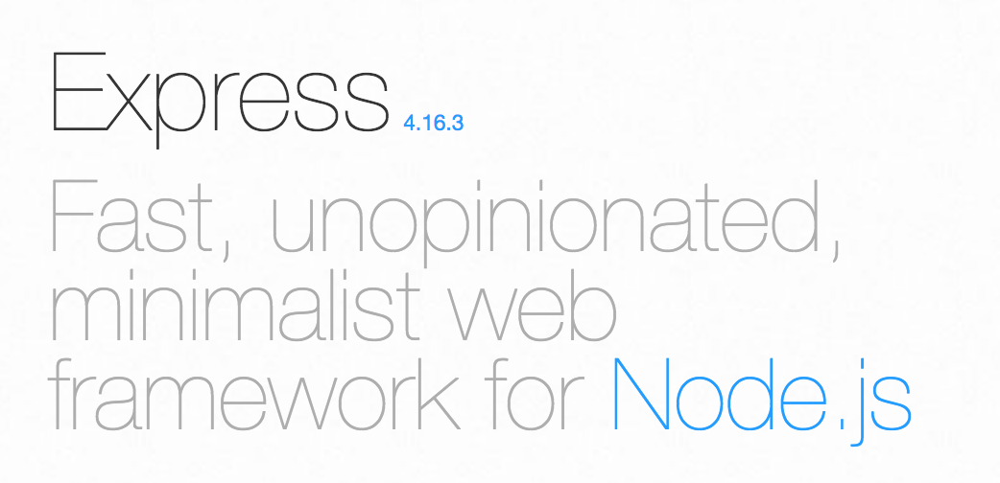

In this series of tutorials we'll be walking through how to create a basic Express application in Node JS.This tutorial will be covering just installing everything we need to get started. Here's what we'll need to install:

* [Node](https://nodejs.org/en/)
* Nodemon: `npm install -g nodemon` from the command line. This will install the command "nodemon" for us to use during development later.
* [MongoDB](https://www.mongodb.com/): we'll be using MongoDB as our database. I prefer installing it and running it locally just for ease of development and not having to worry about signing up for any external service.
* [Robo 3T](https://robomongo.org/): this is a GUI program for MongoDB that makes it super easy to work with data stored in a more visual way.
* An editor: I use [VS Code](https://code.visualstudio.com) the most, but feel free to use whatever you prefer.

## Setting up the project

OK, on to setting up our actual project. Navigate to the location you'd like to create your project an issue the following commands from the command line:

```
mkdir node-express-tutorial
npm init
```

This will create the directory to house our project as well as initialize the directory as an NPM project. You can just accept all the default values during creation. You'll see a package.json file now in the directory which will contain most of the supporting information about our project such as packages we depend on.

Now let's create a couple of directories to give some structure to this project. Even though you could very easily contain all the files in the root directory for a small project like this, it's a good idea to get into the habit of cleanly organizing your projects since when they get larger it'll matter a lot more. For now, let's create these directories:

* routes

  * Used to contain all the files related to registering routes that the user can reach

* controllers

  * All the business logic that should happen once our routes are reached

* models

  * Contains all the structure for the various types of data we'll be dealing with

* util

  * Any miscellaneous functionality that needs to be used in multiple places can go here

* middleware
  * Scripts that define middleware functions (we'll get into this later) for routes go here

---

Now that we've got the directory structure setup, we'll move on to writing some code!
