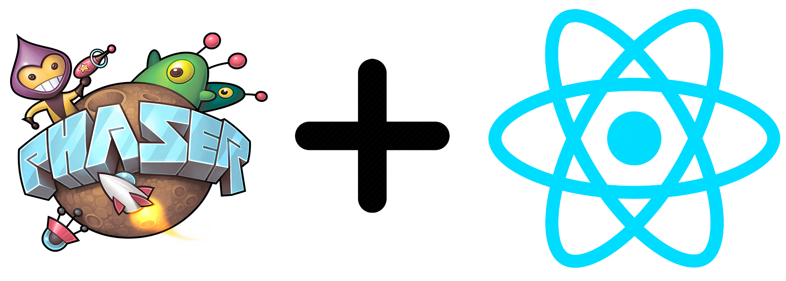
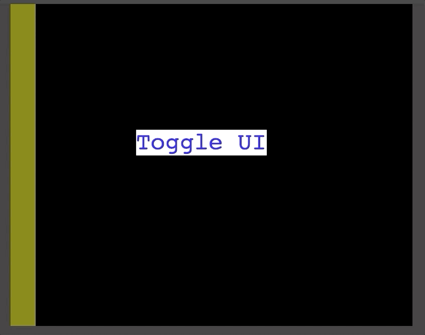

Phaser is an awesome game dev library written in Javascript that makes it incredibly easy to implement your ideas into actual game form. React is an awesome library for building user interfaces in web apps. One thing I was wondering is can we use React to implement game UIs for Phaser?

It's all in the browser, so as long as we can figure out the layout and communication between the two it should be possible. What I've gotten working is a _very_ rough example to show how things might work together!

In this example I won't go over every line of code, but rather concentrate on the important parts which make everything run together. You can check out the [repo here](https://github.com/bschulte/phaser3-react-example). I'm using Phaser 3, React 16 (create-react-app v2 with Typescript) and Redux to connect everything together.

Here's the root JSX pulling everything together:

```ts
class App extends Component {
  render() {
    return (
      <Provider store={store}>
        <div
          style={{
            display: 'flex',
            alignContent: 'center',
            justifyContent: 'center',
            flexDirection: 'row',
            height: '100vh'
          }}
        >
          <UI />
          <Game />
        </div>
      </Provider>
    )
  }
}
```

What we're doing here is pretty straightforward:

* A Redux store being injected into the app (which only contains a flag for whether to show the toggleable UI or not)
* The main div to setup the layout of our window
* The UI and Game components which we'll go into next

Here's our `Game` component:

```ts
export default class IGame extends React.Component<IGameProps, any> {
  componentDidMount() {
    const config: GameConfig = {
      type: Phaser.AUTO,
      width: GAME_WIDTH,
      height: GAME_HEIGHT,
      parent: 'phaser-game',
      scene: [ExampleScene]
    }

    new Phaser.Game(config)
  }

  shouldComponentUpdate() {
    return false
  }

  public render() {
    return <div id="phaser-game" />
  }
}
```

This component is simply responsible for rendering the Phaser game itself. The Phaser game scene simply contains a button that will be used to toggle part of the UI from being shown or not. The other important part here is the `shouldComponentUpdate` method. This method is used by React to determine if the component should re-render or not when there is a change in application state or props being passed to the component. We always want to return false here, since we don't want our actual game to ever re-render, Phaser itself will be responsible for handling everything in the game.

Next up is our UI component:

```ts
class UI extends Component<IUIProps> {
  state = {
    leftOffset: 0
  }

  componentDidMount() {
    this.setState({ leftOffset: this.calculateLeftOffset() })

    window.addEventListener('resize', () => {
      this.setState({ leftOffset: this.calculateLeftOffset() })
    })
  }

  calculateLeftOffset = () => {
    return window.innerWidth / 2 - GAME_WIDTH / 2
  }

  render() {
    const { showUi } = this.props
    const { leftOffset } = this.state
    return (
      <div>
        {/* Left */}
        <div
          style={{
            position: 'absolute',
            left: leftOffset,
            width: LEFT_UI_WIDTH,
            height: GAME_HEIGHT,
            backgroundColor: 'yellow',
            opacity: 0.5
          }}
        />
        {/* Top */}
        <div>
          <Transition
            items={showUi}
            from={{ marginTop: -100 }}
            enter={{ marginTop: 0 }}
            leave={{ marginTop: -100 }}
          >
            {show =>
              show &&
              (props => (
                <div
                  style={{
                    ...props,
                    position: 'absolute',
                    width: GAME_WIDTH,
                    height: 100,
                    top: 0,
                    backgroundColor: '#fcfcfc'
                  }}
                />
              ))
            }
          </Transition>
        </div>
      </div>
    )
  }
}
```

There are two main UI components here:

* A toggleable top bar that shows/hides when the button in Phaser is clicked
* The statically positioned bar that runs along the left side of the game

These two components now render something that should look like this:


The light gray is just the background color of the browser window. The black is where the game itself is.

We've setup our parent div to use `display: flex` and center aligned the children so our game is appearing in the center of our browser window.

The first part we'll cover is the bar on the left. We have it positioned with `position: absolute` so we need to give it the proper offset to have it sit where we want it over the game screen. We figure out that offset with our `calculateLeftOffset` method in the class. This gets the window width and positions the UI div in the center of the screen moved to the left by half of the game's width. Effectively this just sets up the div to be up against the left side of the game. We also setup an `eventListener` on window resize to make sure that when the browser is resized the UI element will still be positioned properly.

Let's take a look now at the toggleable UI component:



We're using [React Spring](https://github.com/react-spring/react-spring) to have some simple animation going here. Check out their repo for details, but all we're doing here is transitioning from a margin which pushes the div off-screen to a margin of 0 which leaves it at the top fo the screen. The div is once again positioned with `position: absolute` to have allow it as an overlay above the game. We give it a value of `top: 0` to have it stick to the top of the screen. The `display: flex` of its parent and the associated positioning config takes care of positioning it in the middle of the screen for us.

That covers the actual display of it, but how does it get toggled? This is handled directly within Phaser! Inside our game scene, we have a button in the middle of the screen which toggles the UI to show or not. This is handled via a Redux store within the scene:

```ts
import store from '../store'
import { TOGGLE_UI } from '../store/gameReducer'

export default class ExampleScene extends Phaser.Scene {
  create() {
    const text = this.add.text(250, 250, 'Toggle UI', {
      backgroundColor: 'white',
      color: 'blue',
      fontSize: 48
    })

    text.setInteractive({ useHandCursor: true })

    text.on('pointerup', () => {
      store.dispatch({ type: TOGGLE_UI })
    })
  }
}
```

I won't show the Redux code here, you can check out the repo if you want the specifics. It's a bare-bones setup with just the ability to toggle one value which represents if we should show the top UI bar or not. If you've used Redux outside of React you might know that you can use the Redux store to directly dispatch actions in order to change the state. We're taking advantage of that here to dispatch an action once the button inside of the Phaser scene is clicked.

This is the important part of how we communicate between React and Phaser. Using the Redux store, we're able to have Phaser communicate to React to tell the UI how to render. This can be used for all types of things from setting the player's health value to showing which items should be shown in an inventory menu.

---

This wraps up the explanation of how you can use React to render UIs for your Phaser game. In a future post I hope to expand on this to show some more real world examples and how the UI might communicate back to the Phaser game.
