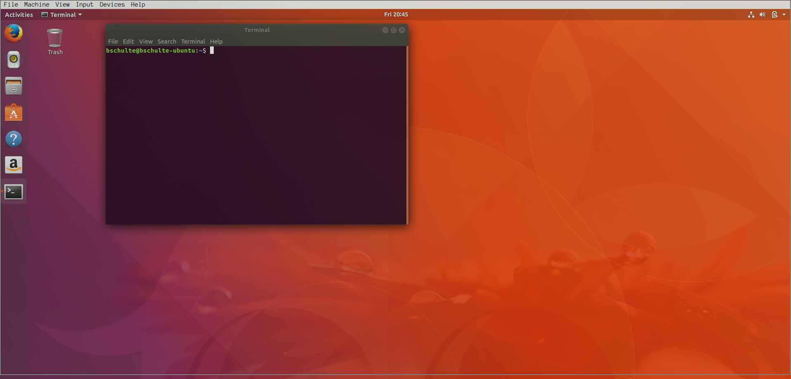

Before getting started with installing, configuring and showing off Zsh, let's go over some command line basics so we're all on the same footing. Once you're on the command line, you can simply issue commands by typing them into the prompt and hitting enter. Each command run by the shell is just a program being executing by the computer, nothing more, nothing less. Once you start figuring out what's happening behind the scenes, the command line becomes much less overwhelming.

## Navigation

The command line is very similar to a typical desktop file browser in the sense that when you're on the command line you're always in the context of some directory within your file system. By default, when you first start up the terminal you're in your home directory of the system.

### _pwd_

pwd is the command that we can use to show what directory we're currently in. If you execute it when you first start the terminal, it should show your home directory. Notice that the command is in all lowercase. All command executed are case-sensitive.

### _ls_

ls shows all the files within the given directory. If given no additional parameter, it'll display the files in the current directory. In most terminals, different colors will denote different file types whether they are standard files or directories.

### _cd &lt;dir&gt;_

cd is the main tool for moving around the file system. It lets you change directory of the command line to the target &lt;dir&gt;. So if there's a "Downloads" folder in your current directory, "cd Downloads" will take you to the Downloads directory. "cd .." is the way to move up a directory (specified by the ".." target).

### _mkdir &lt;dir&gt;_

Say that you want to create a new directory. That's as simple as executing the command "mkdir &lt;dir&gt;" where &lt;dir&gt; is the name of the directory you want to create.

## Package Installation

These tutorials are based on Ubuntu Linux, but the practice remains the same. From the command line you are able to install many packages onto your system that can range from media codecs to cloud storage programs. In Ubuntu, the command used to install packages is "apt". "apt install &lt;package&gt;" is used to install a targeted package onto your system. More specifically, you should issue the command "sudo apt install &lt;package&gt;" command. So far, we've only been executing commands within the context of our normal user. When a more sensitive function is to be performed, root privileges are needed. Prefacing any command with "sudo" lets the system know that the following command should be run as the root user.

---

These minimal commands should be enough to get you pretty far in your journey on the command line. Any other function you need to perform on your system can typically be executed through the command line. For anything you might come across just try Googling "&lt;task I want to do&gt; command line" such as "unzip file command line" and you'll typically find your answer.

So far, we've been using the default shell Bash to execute commands. The shell is just the program which interprets the commands you type to tell the computer what to do. Zsh is just an alternative shell to Bash and provides some additional functionality. Let's get started installing it so we can see some of those things!
