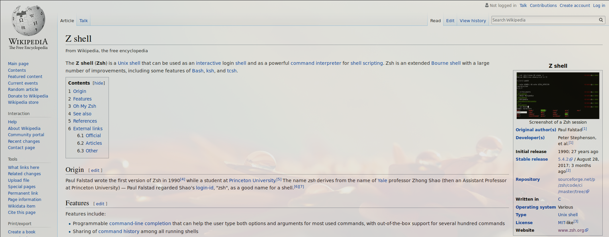
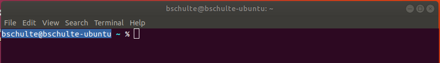
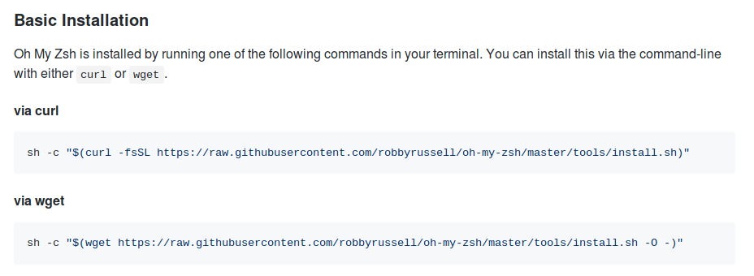
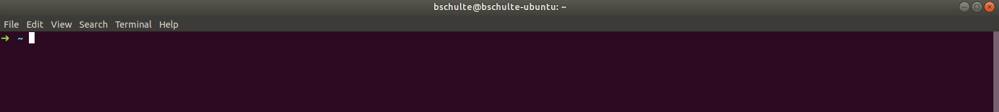
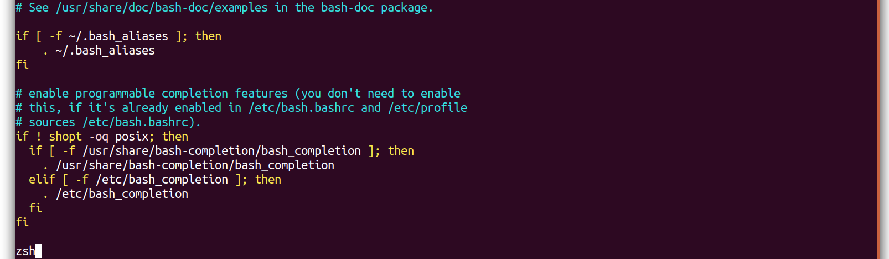
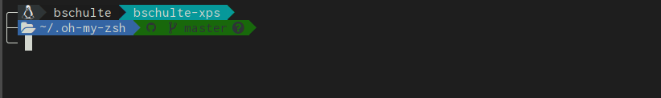
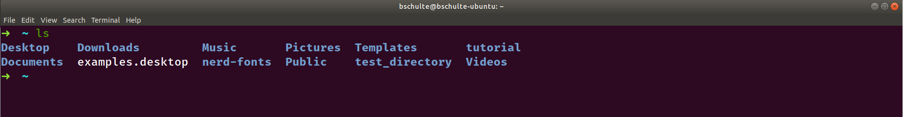

Now that we have the basics of navigating the command line down, let's begin with installing Zsh and all the other things that we need.

## Installing Zsh

For Ubuntu, installing Zsh is as simple as issuing the command:

`sudo apt install zsh`

Try Googling for how to install Zsh if your system is not Ubuntu, it should be pretty straightforward.

After the package has finished installing, simply issue the command: `zsh`

This will give you a prompt asking what you want to do about the configuration file for Zsh. ".zshrc" is the file used to configure everything about the shell. For now, you can select "2" which will generate a sample config file for you. Once the config file is generated, you'll be dropped into your brand new Zsh shell and have a prompt similar to this being shown:

Before we go any further, let's install a couple other utilities that expand upon Zsh's functionality.

## Installing oh-my-zsh

oh-my-zsh is:

> A delightful community-driven (with 1,000+ contributors) framework for managing your zsh configuration.

A delightful community-driven (with 1,000+ contributors) framework for managing your zsh configuration.

`sudo apt install git`

Curl isn't installed by default on Ubuntu so you can either install it via "sudo apt install curl" or just copy and paste the wget command. To paste into your terminal, you might have to use ctrl+shift+p or right click inside the window. Once oh-my-zsh is installed it'll try to set zsh as the default shell to use. You'll then see a new prompt that should look something like:

I've had an issue where sometimes it doesn't set Zsh properly as the default shell and when I open the terminal again I'm greeted with Bash. One hackish way to solve this issue is to edit your ~/.bashrc file and put a single line at the end that just says: "zsh". That'll make sure to launch Zsh whenever Bash starts up. Here's an example of what that could look like, you can use vim, nano, gedit or any other program you want to edit the file:

The next thing we have to do is install some custom fonts to make things look fancy.

## Installing Nerd Fonts

Zsh allows us to have some pretty cool prompts and to display them to their fullest extent we need to install some custom fonts that can display nice looking icons so we can get a prompt to look something like:

My fonts of choice are [Nerd Fonts](https://github.com/ryanoasis/nerd-fonts). Check out their GitHub page where they offer multiple ways to install the fonts. The easiest one for me has to just been to clone their repository and run the "install.sh" script they provide. This will install all their available fonts onto your system.

To clone the repository, simply issue the command:

`git clone https://github.com/ryanoasis/nerd-fonts`

That'll download the entire repository into your current directory. It might take a bit, the font files are pretty large.

Once the download is complete you can issue the command to install the fonts on your system:

`./nerd-fonts/install.sh`

Once the installation is complete, you can change the font displayed by your terminal. Check Google for how to do that for the specific one you're using, but if you're using the default Gnome Terminal that comes with Ubuntu you can right click on the terminal and select "Profiles->Profile Preferences". On the preferences screen, check the box at the bottom for "Custom font:" and then select one of the Nerd Fonts that look good to you (type in "nerd font" in the search field to narrow down your choices to your newly installed fonts).

I like Fira Code for a font, so I selected the Nerd Font equivalent of that which is FuraCode Nerd Font Medium. I recommend going with the Medium version of whatever font you choose Once selecting the new font, your terminal will then render with your choice:

---

Now that we've got everything installed, let's go ahead and start configuring the prompt to make visual and workflow improvements.
