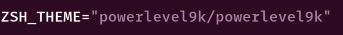

[](https://www.youtube.com/watch?v=QO5Fas-khew)

One of the great things about Zsh is the massive amount of customization you can do to the prompt allowing you to show a whole bunch of different pieces of information. Oh-my-zsh comes with a ton of different themes, but the one I like to use is "Powerlevel9k". Check it out at its GitHub page to see more info about it.

The GitHub page shows some easy installation instructions for oh-my-zsh users:


So let's go ahead and issue the git command to clone the directory into oh-my-zsh's directory for custom themes. Then, we'll edit the ".zshrc" file to reflect our new theme:



With these simple changes made, let's reload our Zsh config file with:

`source ~/.zshrc`

You should see a prompt similar to this:


Out of the box, powerlevel9k sets up some nice default options. You'll have your username@host on the left followed by your current directory with the return status, line number, and time of the last command you ran. In order to customize your prompt as you want it, you'll want to check out the "[Stylizing Your Prompt](https://github.com/bhilburn/powerlevel9k/wiki/Stylizing-Your-Prompt)" section of the wiki. That has all the info that you might need for getting things looking how you want them.

For this tutorial though, I'll walk you through the steps that I took to get things looking how I have them (picture in the beginning of the post).

## Newlines

The first thing we'll do is make it so that the prompt is on a newline as well as having a newline after the output of the command you run. I prefer having things a bit more spaced out like this, makes it easier to read. Add these lines in your ".zshrc" file before you set your theme:

```
POWERLEVEL9K_PROMPT_ON_NEWLINE=true
POWERLEVEL9K_PROMPT_ADD_NEWLINE=true
```


## Customizing the Sections of the Prompt

Powerlevel9k also has built in sections of their prompt that are available for you to include as you wish (on either a left or right side prompt - I only use the left). The available segments for the prompt are shown in the "[Available Prompt Segments(https://github.com/bhilburn/powerlevel9k/blob/master/README.md#available-prompt-segments)]" section of the README.

To have the same sections as I've got, also add in these lines to your ".zshrc" config after the ones you just added:

```
POWERLEVEL9K_LEFT_PROMPT_ELEMENTS=(os_icon user host newline dir vcs)
POWERLEVEL9K_RIGHT_PROMPT_ELEMENTS=()
POWERLEVEL9K_MODE='nerdfont-complete'
```

This will give us the OS icon, followed by our "username host" string and the current directory and version control information (such as git or svn) on a newline.

Also introduced here is we're telling powerlevel9k that we've installed Nerd Fonts and it should use that for the icons.


## Setting up the Colors

You can set up the colors of each part of the prompt to anything you'd like with powerlevel9k. Check out the Stylizing Your Prompt section of the GitHub page to find all the options. In particular, the command:

`for code ({000..255}) print -P -- "$code: %F{$code}This is how your text would look like%f"`

is useful to see what number corresponds to what color on your terminal. To save time, you can just copy and paste the following config lines to copy the settings that I have. Just know that you can edit each of these colors in any way you like based on the colors that are outputted by the previous command.

```
POWERLEVEL9K_DIR_HOME_FOREGROUND='white'
POWERLEVEL9K_DIR_HOME_BACKGROUND='004'
POWERLEVEL9K_DIR_HOME_SUBFOLDER_FOREGROUND='white'
POWERLEVEL9K_DIR_HOME_SUBFOLDER_BACKGROUND='004'
POWERLEVEL9K_DIR_DEFAULT_FOREGROUND='white'
POWERLEVEL9K_DIR_DEFAULT_BACKGROUND='004'
POWERLEVEL9K_VCS_CLEAN_FOREGROUND='white'
POWERLEVEL9K_USER_DEFAULT_BACKGROUND='234'
POWERLEVEL9K_USER_DEFAULT_FOREGROUND='white'
POWERLEVEL9K_USER_ROOT_BACKGROUND='234'
POWERLEVEL9K_USER_ROOT_FOREGROUND='white'
POWERLEVEL9K_HOST_REMOTE_BACKGROUND='red'
POWERLEVEL9K_HOST_REMOTE_FOREGROUND='white'
POWERLEVEL9K_HOST_LOCAL_BACKGROUND='006'
POWERLEVEL9K_HOST_LOCAL_FOREGROUND='white'
```

Following that and a reload of the config file with "source ~/.zshrc" we're almost there. A change of the default background of the terminal is all we need to finish getting things to look like our target appearance at the beginning of the post. For gnome-terminal, it's pretty easy to change the background color, just right click inside the terminal and follow these steps:


I've also added a bit of transparency to the terminal.

---

Now that the prompt is complete let's move on to finally checking out some of Zsh's actual features!
